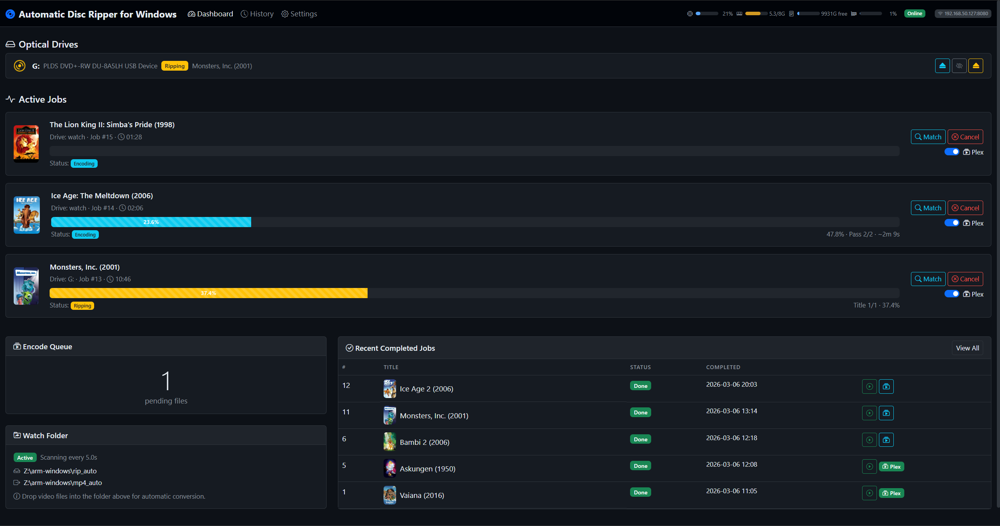

# Automatic Disc Ripper — Proxmox LXC edition

[](https://github.com/hhammarstrand/Automatic-Disc-Ripper-proxmox/actions/workflows/tests.yml)
[](LICENSE)

Automatic, hands-off DVD/Blu-ray ripping for your homelab. Insert a disc and it
is ripped with **MakeMKV**, transcoded to MP4 with **HandBrake**, identified and
named via **TMDb**, and dropped into a Plex-ready folder — all inside a single
**Proxmox LXC container** that installs itself with one command.



> This is the Linux/Proxmox port of *Automatic Disc Ripper for Windows*. The disc
> layer was rewritten for Linux (`/dev/sr*`, `eject`); everything else — the
> pipeline, web UI, TMDb matching and Plex handling — is unchanged.

---

## Features

- **Zero-touch pipeline:** detect → identify (TMDb) → rip (MakeMKV) → eject → transcode (HandBrake) → Plex-ready output.
- **Every kind of disc**, not just films: DVDs and Blu-rays transcode, **audio CDs** become tagged FLAC or MP3, **data discs** become ISO images.
- **One-command install** on the Proxmox host: creates the container, passes the optical drive through, installs everything, starts the service.
- **No compilation:** MakeMKV from the `heyarje/makemkv-beta` PPA, HandBrakeCLI from Ubuntu universe.
- **Automatic MakeMKV key:** fetches the current free beta key, or accepts your own.
- **Web dashboard** (port 8080) with live progress, job history, a Storage page for NAS setup, settings, and in-browser playback.
- **Doctor page** that self-diagnoses drives, tools, keys and storage — and updates the app from GitHub with one button. It also checks the update mechanism itself, because a break there is silent: the button writes a flag, a watcher has to notice it, and the service it starts has to have something to run.
- **Logs page** with the service's own log, filterable by level and text — no `pct exec`, no journald, no shell.
- **Test encoding** without a disc: encodes two seconds of video with whatever is actually configured, and says what the encoder objected to.
- **Hardware encoding, and the ways it goes wrong**: the installer passes the host's GPU through and installs the driver stack — the right VA-API driver, and both Quick Sync runtimes, because they cover different processor generations. When Quick Sync still will not start, the encoder test finds out whether a driver name fixes it, whether ffmpeg can reach the same GPU, or whether software is the honest answer — by trying each, not by guessing — and the diagnostics bundle asks the oneVPL dispatcher which library it turned down.
- **Never encodes a film into silence.** HandBrake has no language fallback: a disc with no track in the language you asked for selects no audio, writes the film mute, and exits 0. The file is read first, and a disc that cannot answer in that language keeps the audio it does have. The output is checked against the source afterwards too, because an unsatisfiable passthrough and a refused mixdown both drop tracks the same silent way — audio in and none out is a failed job, not a finished film.
- **One set of encoding settings** — spoken language, quality, height cap — told to whichever encoder runs, so switching encoder does not silently change the result.
- **Copy diagnostics**: one button produces everything needed to diagnose the install as a single paste, with keys and tokens removed.
- **Two discs of one box set are told apart on the dashboard** — the card says `Disc 2` while it rips and `S01E06–E10` once the episodes are known, instead of three identical cards all reading the show's name.
- **Television discs**: box sets are recognised from title durations and named `Show (Year)/Season 02/Show (Year) - S02E05.mp4` — and a bonus clip on the disc is filed as an extra instead of taking an episode number, which would shift every episode after it.
- **Says when a season is short**: after every box-set disc it compares what is in the library against TMDb's episode list and reports "season 1 has 5 of 13 episodes, still missing 6-13" — in the job log and in the finish notification, so the next disc gets asked for rather than noticed weeks later in Plex. How many *discs* a set has cannot be looked up; that is a property of one pressing in one region, and counting episodes catches a gap in the middle that counting discs never would.
- **Series mode**: set the show once, then feed a whole box set — the episode number carries across discs on its own. When the disc label names the disc (`SHOW_S01_D2`), the numbering continues from the earlier discs without being asked, and a re-rip of a disc already done is recognised as one rather than appended.
- **Notifications** to ntfy, Gotify, Discord or a webhook when a disc finishes or fails — the pipeline is unattended, so it tells you.
- **Plex library refresh** the moment a film lands, instead of waiting for the next scheduled scan.
- **Per-job logs** in the UI: what MakeMKV and HandBrake actually said, without SSH.
- **Progress that answers the question**: time remaining, read speed and elapsed time for the rip, not just a percentage.
- **Duplicate detection** against the library itself, the TMDb id and the disc label — optionally skipping the rip entirely.
- **Retry** a failed job from whatever is still on disk — a broken NAS should not cost you a 40-minute rip. A rip that never finished is refused rather than encoded, because its files are truncated mid-frame.
- **Encode again** with the settings as they are now, from the raw rip when it survives and from the finished file when it does not — and it says which, because the second is a generation lossier.
- **Select and delete** several jobs at once, optionally with the files they produced: shown as a list of real paths first, and narrow enough that a library folder shared with other films comes out with those films intact.
- **Says what is broken before you insert a disc**, with the fix, instead of letting every disc fail separately with the same reason.
- **Survives a restart mid-job**: an interrupted encode picks itself up on the next start, and nothing is left saying "ripping" for ever.
- **Notices a drive that has stopped answering** instead of waiting on it for the rest of the service's life.
- **Multi-drive** support and a **watch folder** for batch encoding of existing video files. Name the drives and they are named everywhere you read them — "Saltkråkan DVD 2 in Internal", not "in /dev/sr0". The device node stays in the diagnostics bundle, because that is what you type into `pct exec`.
- **Transcoding is optional** — keep the lossless MKV straight off the disc instead, if size is cheaper than time.
- **Extras kept apart** from the film, in a folder Plex actually recognises, so a trailer never becomes the second half of the movie — including when the disc carries a commentary version exactly as long as the film.
- **Main feature only**, honoured even when the pre-rip scan cannot read the disc: the rest is ripped but not encoded, and stays on disk rather than filling the library.
- **An empty drive is an empty drive**: no job is created for one, and each way of having no disc — empty tray, open tray, missing passthrough, denied cgroup — says what to do about it in a sentence.
- **Install via Claude for Chrome** — paste one prompt and it does the whole thing for you.

---

## Quick Start (one command)

On your **Proxmox host**, as root — via SSH or the node **Shell** in the Proxmox web UI.

### If this repository is public

```bash
bash -c "$(curl -fsSL https://raw.githubusercontent.com/hhammarstrand/Automatic-Disc-Ripper-proxmox/main/scripts/install.sh)"
```

### If this repository is private

`raw.githubusercontent.com` returns **404** for private repositories unless the
request carries a token, so the bootstrap `curl` needs an auth header too — not
just the clone. Create a
[fine-grained token](https://github.com/settings/personal-access-tokens/new)
scoped to this repository with **Repository permissions → Contents: Read-only**,
then:

```bash
export GITHUB_TOKEN=github_pat_xxx
bash -c "$(curl -fsSL -H "Authorization: Bearer $GITHUB_TOKEN" \
  https://raw.githubusercontent.com/hhammarstrand/Automatic-Disc-Ripper-proxmox/main/scripts/install.sh)"
```

The exported `GITHUB_TOKEN` is picked up automatically by the installer for the
subsequent `git clone` and for the in-container fetch — you only set it once.

> **If the command returns instantly with no output**, the `curl` fetched
> nothing (bad token or wrong URL) and `bash -c ""` simply did nothing. That is
> a fetch failure, not a successful install. Check it with:
> ```bash
> curl -fsSI -H "Authorization: Bearer $GITHUB_TOKEN" \
>   https://raw.githubusercontent.com/hhammarstrand/Automatic-Disc-Ripper-proxmox/main/scripts/install.sh
> ```
> A working token prints `HTTP/2 200`.

> **Tip:** making the repo public (*Settings → General → Danger Zone → Change
> visibility*) lets you and anyone else use the short form above. The installer
> works either way.

### What you'll see

You'll be asked for a few values (container ID, disk size, the optical device,
an optional TMDb key) — press Enter to accept the sensible defaults. When it
finishes:

```
 ✓ Installation complete!
   ┌────────────────────────────────────────────────────────
   │  Web UI : http://192.168.1.42:8080
   │  SSH    : ssh root@192.168.1.42
   │  Root pw: ••••••••••••   (generated — save it now)
   │  CTID   : 200
   └────────────────────────────────────────────────────────
```

Open that URL and you're done. Insert a disc to start ripping.

### What the installer does

1. Downloads the Ubuntu 24.04 LXC template (if missing) and creates the container.
2. Adds optical-drive passthrough to the container config (`/dev/sr*`, `/dev/sg*`),
   and orders guest autostart after the drive exists — otherwise passthrough
   works right after installing and breaks on the next host reboot.
3. Installs MakeMKV, HandBrakeCLI, Python, the app, and a `systemd` service.
4. Fetches/stores the MakeMKV key and starts the service on boot.
5. Runs `adr-doctor --fix` for everything else the host can offer: the GPU, the
   group that owns the render node, the VA-API driver stack. Skipped silently
   where there is nothing to do, and never fatal — a GPU that will not pass
   through is no reason to fail an install that otherwise worked.

### Useful environment variables

| Variable | Default | Purpose |
|----------|---------|---------|
| `CT_ID` | next free | Container ID |
| `CT_CORES` / `CT_RAM` / `CT_DISK` | `4` / `2048` / `100` | CPU cores / RAM (MiB) / disk (GiB) |
| `CT_STORAGE` / `CT_BRIDGE` | `local-lvm` / `vmbr0` | Container storage / network bridge |
| `CT_UNPRIVILEGED` | `0` | `0` = privileged (recommended for optical passthrough) |
| `DISC_DEVICE` | first `/dev/sr*` | Optical device to pass through |
| `MEDIA_HOST_PATH` | — | Host dir already mounted, bind-mounted into the container (e.g. `/mnt/pve/<storage-id>`) |
| `CT_MEDIA_PATH` | `/mnt/media` | Where that mount appears **inside** the container |
| `NAS_URL` | — | `nfs://host/export/path` or `smb://host/share` — mounts a NAS for the finished files |
| `NAS_USERNAME` / `NAS_PASSWORD` | — | SMB credentials (SMB only) |
| `NAS_MOUNTPOINT` | `/mnt/adr-media` | Where the share is mounted on the host |
| `CT_TIMEZONE` | the host's | Container timezone — copied from this host unless set |
| `TMDB_API_KEY` | — | TMDb API key |
| `MAKEMKV_KEY` | `auto` | `auto` (fetch free beta key), a `T-…` key, or empty to skip |
| `ADR_NONINTERACTIVE` | `0` | `1` = no prompts (use the `CT_*` defaults) |

---

## Install via Claude for Chrome

If you have the [Claude for Chrome](https://www.anthropic.com/news/claude-for-chrome)
extension enabled, you can install this in one conversation without touching a
terminal yourself.

**Step 1.** Open your Proxmox web UI (e.g. `https://proxmox.local:8006`) and log in.

**Step 2.** Click your Proxmox node in the left sidebar, then click **Shell**. A
root shell opens in your browser.

**Step 3.** Click the Claude extension icon and paste **exactly** this prompt:

```
You are controlling my Proxmox VE root shell that is currently visible
in this browser tab. Please install "Automatic Disc Ripper" for me by:

1. Verifying the active tab is a Proxmox node shell (it shows a prompt
   like root@pve:~#). If not, ask me to open one first.
2. Typing the following command into the shell and pressing Enter:

       bash -c "$(curl -fsSL https://raw.githubusercontent.com/hhammarstrand/Automatic-Disc-Ripper-proxmox/main/scripts/install.sh)"

3. Watching the installer output. When it prompts me for:
      - container ID (CTID)   -> suggest the number it shows as default
      - hostname              -> suggest "adr"
      - disk / RAM / cores    -> accept defaults (100 / 2048 / 4)
      - CT_UNPRIVILEGED       -> answer "0" (privileged)
      - DISC_DEVICE           -> accept the default it found (e.g. /dev/sr0)
      - TMDB_API_KEY          -> leave empty for now, I will add it later
      - MAKEMKV_KEY           -> type "auto" to auto-fetch the free beta key
   Answer each prompt accordingly.
4. When the installer prints "Installation complete!" and a URL like
   http://<ip>:8080, open that URL in a new tab and confirm the web UI
   loads. Then paste the container IP and the generated root password
   back to me.

Do not run any other commands, do not modify unrelated files, and stop
immediately if any step fails — report the error instead of retrying.
```

**Step 4.** Approve each command when Claude asks. When the web UI opens, you're done.

> If the repository is **private**, replace the command in step 2 of the prompt
> with the token form from [Quick Start](#if-this-repository-is-private) —
> the plain URL returns 404 and Claude will report the install as failed.

> The container web UI has **no authentication** and is reachable by anyone on
> your LAN. Keep it on a trusted network and don't port-forward it to the internet.

---

## Configuration

Settings live in `/opt/adr/config/adr.yaml` and can be edited live from the web
UI under **Settings**. Key options:

| Setting | Default | Notes |
|---------|---------|-------|
| `makemkv_path` | `/usr/bin/makemkvcon` | MakeMKV CLI |
| `handbrake_path` | `/usr/bin/HandBrakeCLI` | HandBrake CLI |
| `raw_path` | `/opt/adr/raw` | Raw MKVs from the disc — always local, deleted after encoding |
| `completed_path` | `/opt/adr/completed`, or `/mnt/media` with a library attached | Where finished films end up |
| `drives` | `auto` | Or a list like `["/dev/sr0", "/dev/sr1"]` |
| `handbrake_preset` | `Fast 1080p30` | Any built-in or custom preset |
| `tmdb_api_key` | — | Free key from [themoviedb.org](https://www.themoviedb.org/settings/api) |
| `plex_path` | — | Plex **movie** library. When set (with `auto_move_to_plex`) films are written **directly** here and never pass through `completed_path` |
| `tv_path` | — | Plex **TV** library. Series go here; they never go to `plex_path`, which has different naming rules |
| `notify_enabled` / `notify_provider` / `notify_url` / `notify_token` | off / `ntfy` | Where to send notifications |
| `notify_events` | `job_done`, `job_failed` | Which events to send |
| `plex_refresh_enabled` / `plex_url` / `plex_token` / `plex_section` | off | Ask Plex to scan when a film lands |
| `require_completed_mount` | `false` | Refuse to start a rip unless the destination is a real mount point — set automatically by `adr-setup-nas` |
| `stage_locally` | `true` | Encode to local disk and transfer the finished film in one copy. Only applies when `completed_path` is network storage |
| `staging_path` | `/opt/adr/staging` | Local scratch used while encoding to network storage |

### Where things live

```
/opt/adr/            the application — code, database, venv, scratch space
  ├─ raw/            raw MKVs straight off the disc   (local, deleted after encoding)
  ├─ staging/        HandBrake writes here            (local, always)
  └─ completed/      finished films, when you have no NAS
       ├─ Music/     albums from audio CDs            (music_path)
       └─ ISO/       images of data discs             (data_disc_path)
/mnt/media/          finished films, when you do      (your NAS or host storage)
```

One rule, and it is the whole design: **nothing is ever mounted inside
`/opt/adr`.** That directory belongs to the application. Your library is a
separate filesystem mounted beside it at `/mnt/media`, and `completed_path`
simply points at whichever of the two you are using.

This matters for more than tidiness. A share mounted over `/opt/adr/completed`
means a routine `chown -R /opt/adr` walks into your film library, and it means
that when the NAS is offline you cannot tell "empty share" from "empty app
directory". Installs made before 1.0 used that layout; `adr-doctor --fix
<CTID>` migrates them.

Ripping and encoding always happen on the container's own disk. Only the
finished MP4 crosses the network, as a single sequential transfer — see
[Local staging](#local-staging) below.

### Keeping the MKV instead of transcoding

**Settings → Encoding → Transcode with HandBrake.** Off keeps the file exactly
as MakeMKV produced it: lossless, and minutes rather than hours, at several
times the size. Nothing else changes — same folder, same name, same move into
the library, same notifications. The watch folder still transcodes, since
transcoding is the only reason it exists.

### The main feature, and everything else on the disc

**Main feature only** (on by default) scans the disc before ripping and takes
the longest title. That scan is the whole of the feature, and when it fails —
a protected DVD with hundreds of dummy titles, a drive still settling — there
is nothing to pick from. What used to happen then was a silent fallback to
ripping all sixteen titles, and nothing anywhere said why.

Now every branch of that decision is written to the job's own log, in
MakeMKV's words where it gave any, and the scan is retried once before it
gives up. It is also allowed fifteen minutes, because five was a guess that a
Disney DVD disproved twice over.

If the scan still cannot run, the disc is ripped whole and the setting is
honoured at the one point left: **only the feature is encoded.** The other
titles stay in the job's raw directory as MKV, so nothing is lost and nothing
is re-ripped, and the job log names them and says where they are.

### Extras

With main-feature selection off, a disc's trailers and featurettes are ripped
too. They used to be named `Film (1999) - pt2`, `pt3` and so on, and Plex
*stacks* numbered parts — it treats them as one film split across files, so a
two-minute trailer became the back half of the movie.

When one title is at least 1.5× longer than the next, it is the feature and the
rest go to `Film (1999)/Other/Extra 1.mp4`. `Other` is one of the eight folder
names Plex recognises for local extras, and the only one that does not claim to
know what the extra *is* — MakeMKV reports a duration and nothing else.

Titles of similar length are left as numbered parts, because that is what a
genuinely two-part film looks like, and calling half a film an extra is the
worse of the two mistakes.

Two things defeat that rule on real discs, and both used to end in sixteen
numbered parts:

- **A commentary version of the film** is exactly as long as the film, so
  nothing stands 1.5× clear of anything.
- **A title with no duration** — the durations come from MakeMKV's records
  matched to files by name, and every step of that can come back empty.

So the rule now applies only where the question is genuinely open. Past three
titles there is no multi-part release left to protect, and someone who asked
for the main feature has already said which title they want; in both cases the
longest one is the film. If no duration is known at all, size decides — a
968 MB file beside fifteen between 9 and 83 MB is not ambiguous.

### Discs that are not films

Not everything in an optical drive is a film, and until 1.3 everything was
handed to MakeMKV anyway. An audio CD came back as "no titles found" — which is
exactly what an unreachable drive looks like, so the failure sent you off
debugging hardware that was fine.

Every disc is now classified first, from its table of contents and its ISO 9660
root directory. Nothing is mounted and no extra privileges are needed.

| What is in the drive | What happens | Where it lands |
|---|---|---|
| DVD / Blu-ray | MakeMKV → HandBrake, as before | `completed_path`, `plex_path` or `tv_path` |
| Audio CD | cdparanoia → ffmpeg, tagged from MusicBrainz | `music_path` (default `completed_path/Music`) |
| Mixed-mode CD | the audio tracks are ripped, the data track ignored | `music_path` |
| Data disc | byte-for-byte ISO image | `data_disc_path` (default `completed_path/ISO`) |

A disc that cannot be read at all is still treated as video — that is what the
application did before any of this existed, so a pure-UDF Blu-ray with no
ISO 9660 descriptor keeps working exactly as it used to.

**Audio CDs.** cdparanoia does the extraction because CD audio has no error
correction worth the name: a scratch does not produce a read error, it produces
a click, and cdparanoia re-reads and overlaps until the samples agree.
MusicBrainz supplies artist, album, year and track names, looked up by a disc
ID computed from the track layout. Output is `Artist/Album (Year)/01 - Title.flac`,
which is what every music server expects. A CD nobody has ever submitted still
rips — it is filed under its disc ID, which is stable, so the same disc always
lands in the same folder. One unreadable track costs you that track, not the
album.

Set the format (FLAC or MP3), the bitrate and the folder under **Settings →
Audio CDs**, or turn the whole thing off there if you would rather an audio CD
were left alone.

**Data discs.** Only the recorded part of the disc is read: a drive routinely
reports more capacity than the disc holds, and reading past the end produces
I/O errors that look like a failure and are not. The size comes from the ISO
9660 volume descriptor when there is one. A read error is retried before it is
believed, and a copy that fails is deleted rather than left behind — a
half-written ISO that looks complete is worse than no ISO at all.

### Television discs

A box-set disc is not a film with extras: six episodes of similar length, none
of them a "main feature". Left alone, main-feature selection would rip the
longest and silently discard the other five.

So a disc is recognised as television from its **title durations** — three or
more titles of similar length between 15 and 75 minutes — because that is all
that is known before anything is ripped. Grouping is real clustering: every
title in the group must be close to every other, not merely to whichever one
the scan started from, or a 16-minute featurette bridges into four 22-minute
episodes.

Detection **acts, and says what it did.** The dashboard shows the guess with
its reasoning — including every title length it saw, so a wrong verdict is
correctable rather than baffling — and the show, season and starting episode
are editable from the moment the disc is recognised until encoding begins.
Nothing waits for you: a disc left unattended is ripped and named on the
strength of the guess, because the alternative is a machine that stops halfway
through a box set at three in the morning. If the heuristic misfires on a
film, the fix is to press *Not a series* before the encode starts, or to move
the folder afterwards. Any job can equally be marked as a TV disc by hand
while it is still ripping.

The show is looked up against TMDb's **TV** catalogue, which is a different
namespace from films: identification has already run a *film* search, and for a
box set that returns a confident-looking film. Picking the show corrects the
title, year and poster, and the file names are previewed against the season's
real episode titles — which is how an off-by-one is caught before forty minutes
of encoding rather than after.

#### Series mode — working through a box set

Marking one disc as television is a small thing. Doing it for six discs of a
season — re-entering the show, the season, and the episode each disc starts at —
is not, and that last number is both easy to get wrong and expensive to get
wrong: a third of the season silently misnumbered, which Plex will happily
display as the wrong episodes.

**Rip a TV series** on the dashboard is a sticky answer to those questions plus
a counter. Set the show and season once, then feed discs:

```
disc 1 → The Wire (2002)/Season 02/The Wire (2002) - S02E01 … E04
disc 2 → …                                                   S02E05 … E08
disc 3 → …                                                   S02E09 … E12
```

The counter advances by however many titles each disc actually produced, so
disc 2 starts at 5 because disc 1 yielded four episodes — not because anyone
said so. If a disc holds a feature-length extra that looked like an episode,
**Fix episode number** in the banner winds it back without re-ripping anything.

While the mode is on it takes over completely: the film identification is
skipped (it is a *film* search, and for a box set it returns a confident-looking
film that would overwrite the show you just named), and main-feature selection
is skipped so every episode is ripped rather than just the longest.

It does not expire. A mode that switched itself off after some interval would
be surprising in the worst way — discs 4–6 of a season quietly numbered from 1
again. It stays until you turn it off, and every page carries a banner saying
so.

#### Thresholds

The thresholds are settings, not constants: anime runs to 24 minutes, a
documentary series to 55, and some box set will sit outside any default.
**Settings → Television** has the shortest and longest episode length, how many
similar titles count as a season, and a switch to turn detection off entirely.

Output follows Plex's TV layout:

```
Show Name (2019)/Season 02/Show Name (2019) - S02E05.mp4
```

Set `tv_path` to your Plex **TV** library. Series never go to `plex_path`:
Plex keeps films and shows in separate libraries with different naming rules,
and a season folder in the movie library is not something it can make sense of.

### Notifications

The pipeline is meant to be unattended — put a disc in, walk away. Without
notifications the only way to learn a rip failed forty minutes ago is to open
the dashboard and look.

| Service | URL to give it |
|---|---|
| **ntfy** | `https://ntfy.sh/your-secret-topic` — pick a topic nobody would guess; anyone who knows it can read your notifications |
| **Gotify** | the server root, e.g. `http://192.168.1.10:8080`, with the application token |
| **Discord** | a channel webhook from *Channel settings → Integrations → Webhooks* |
| **Webhook** | anything that accepts a JSON POST of `{event, title, message}` |

Events are opt-in per type: a disc finished, a rip failed, a disc was inserted.
**Send a test notification** under Settings uses the values on the form rather
than the saved ones, since testing before saving is the only moment a test is
useful.

Delivery is best-effort with a short timeout. A notification service being down
never fails a rip — the film is on disk either way.

### Plex library refresh

Set `plex_url`, `plex_token` and pick a library, and Plex is told to scan the
folder as soon as a film lands there. Without it the film exists on disk and is
invisible in Plex until the next scheduled scan, which reads as the ripper
having failed.

The token: in Plex, open any item → *Get Info* → *View XML*, and copy
`X-Plex-Token` out of the URL. **Fetch libraries** then lists them so you pick
one instead of guessing a section key.

### Hardware encoding

A preset exported from HandBrake on a desktop asks for that desktop's encoder
— Intel Quick Sync, NVENC, VAAPI. Inside an LXC none of them exist unless the
GPU was passed through, and HandBrake fails the same way on every title of
every disc:

```
ERROR: encqsvInit: qsv is not available on the system
Encode failed (error 3).
```

Exit 3 is an initialisation failure, decided before any video is touched,
which is why it is identical every time and why forty minutes of ripping is
wasted before you see it.

**Doctor → Encoding → Test encoding** answers it in seconds with no disc,
and **Doctor → Hardware encoding** says whether a GPU is reachable at all. The
two are separate questions: a preset can want hardware that is present but
unsupported by the build, and a container can have a GPU nobody's preset uses.

`adr-doctor --fix <CTID>` on the Proxmox host adds the passthrough — the DRM
character major and a bind of `/dev/dri` — alongside the optical drive it
already handles. It only offers this when the host actually has a render node,
because binding a device that is not there would be noise.

It also does the half that passthrough alone does not solve. `renderD128` is
`crw-rw---- root:render`: passing the node in makes it visible, opening it
still needs the service user to be in the owning group. In a privileged
container gids map straight through, and the host's `render` gid is almost
never the container's — Proxmox is Debian, the container is Ubuntu, and they
number system groups differently. So the group is matched **by number**, which
is the only thing the kernel checks; advice to `usermod -aG render adr` would
look right and change nothing.

And it installs the driver stack, which is the third thing and the one that
looks solved. The render node passed through and the group right, and
HandBrake still says `qsv is not available` — because Quick Sync does not talk
to the kernel directly. It reaches the hardware through a VA-API driver and a
Media SDK / oneVPL runtime, and a minimal container image ships neither. The
driver is checked against the PCI vendor of the actual card, and the runtime
is told apart from the *dispatcher* (`libvpl.so`), which loads a runtime and
encodes nothing itself.

### The three packages, and why each one is chosen the way it is

Ubuntu's `handbrake-cli` **is** built with Quick Sync — the source package
build-depends on `libvpl-dev`, the oneVPL dispatcher. What it ships is a
loader, and a loader needs something to load. Without a runtime it reports
exactly what a machine with no GPU reports, which is why this went undiagnosed
for a long time.

**The driver is a choice, not a list.** `intel-media-va-driver-non-free` and
`intel-media-va-driver` Conflict with and Replace one another, so installing
both in sequence leaves the *worse* one: the free build has no HEVC encode, no
MPEG-2, no VP8 and no Quick Sync. The installer, the in-app update and
`adr-doctor --fix` all try them in order and stop at the first that installs.
`i965-va-driver` is last and only reached when neither iHD build exists —
beside iHD it gives libva two drivers to choose between for the same chip.

**The runtimes are a genuine list**, and there are two because they cover
different silicon:

| Package | Library | Covers |
|---|---|---|
| `libmfx1` | `libmfxhw64.so` | Gen 9–11: Skylake through Comet Lake and Ice Lake |
| `libmfxgen1` | `libmfx-gen.so` | Alder Lake and later, including Xe and Arc |

They do not conflict, so both are installed and the dispatcher picks. Having
*one* of them is not the same as having the right one: the oneVPL GPU runtime
refuses a Gen 9.5 chip outright and the Media SDK stops at Gen 11, and
HandBrake reports both cases identically. The Doctor page names which one is
installed and what it covers.

`libmfx1` is the deprecated Intel Media SDK, and deprecated is not the same as
broken — it still starts on Gen 9.5 hardware with the non-free iHD driver.
HandBrake's own minimum is Media SDK API 1.3, for Sandy Bridge.

### The variable that connects Quick Sync to the GPU

Quick Sync does not open the GPU itself. It goes through whichever VA-API
driver **libva** loads, and the Media SDK is built against a particular one. A
container with both `iHD` and `i965` installed can therefore have a working
GPU, a working Media SDK, and no way to connect them — because libva picked
the other driver. What it reports is `qsv is not available on the system`,
which is exactly what it says when there is no GPU at all.

`LIBVA_DRIVER_NAME` decides it and nothing on the system says which value is
right, so the encoder test tries them: every hardware encoder against every
candidate driver, each attempt a real two-second encode. When a pairing works,
**Use HandBrake with the GPU** pins the driver, overrides only the preset's
video encoder — the rest of the preset survives — and re-runs the test before
committing. If it fails on the second look, every setting goes back.

HandBrake has no VA-API encoder on any platform: Intel goes through Quick
Sync, AMD through VCE. `qsv_h265` and `qsv_h264` are the alternatives worth
trying, and they are what the probe tries.

### When HandBrake cannot reach a GPU that works

There is a case where everything above is correct and hardware encoding still
does not happen: the node is passed through, `vainfo` loads the driver and
lists encode profiles — and no hardware encoder in HandBrake will start. The
GPU is fine the whole time.

Usually the answer is a missing package from the table above, and the Doctor
page says which. But three different problems produce the same sentence —
`qsv is not available on the system` — and nothing that reads a directory
listing can tell them apart: no runtime, a runtime that refuses the chip, and
a runtime the driver will not talk to.

So the diagnostics bundle asks the dispatcher directly. `ONEVPL_DISPATCHER_LOG`
makes it name every library it opened and why it turned each one down, and
HandBrake builds its encoder list at startup, so `--help` is enough to trigger
the attempt. The bundle carries a one-line verdict and the log's tail — only
when a hardware preset has no hardware encoder, because a working setup should
not be made to run a post-mortem on itself.

**Settings → Encoding → Encoder** offers the way round it regardless: `ffmpeg
on the GPU (VA-API)`. Same hardware, different road, and ffmpeg is already
installed for audio CDs. It stays as a supported backend rather than a
stopgap, for three reasons: HandBrake has no VA-API encoder on any platform,
so on an AMD GPU it is the only hardware path; the Media SDK is deprecated and
one day will stop starting for real; and it is the probe that proves the
*hardware* works while HandBrake is failing, which is what separates "the GPU
is broken" from "HandBrake cannot reach it".

The encode test probes both and offers the switch when it applies — having
first encoded a test clip, because a page that promises hardware encoding and
delivers a failed job would be the same mistake in a new place.

### Settings that mean the same thing either way

Two encoders now do the transcoding, and they used to be configured in two
unrelated ways — a HandBrake preset on one side, a set of `vaapi_*` values on
the other. So "I want Swedish audio" was a preset property in one and a
setting in the other, and switching encoders silently changed the result.

Three settings describe the *result*, and both encoders are told about them:
**spoken language**, **quality**, and a **height cap**. For HandBrake they
become `--audio-lang-list`, `-q` and `--maxHeight`, applied after the preset so
each replaces one value and leaves the rest of it intact. The language list
only — *how many* matching tracks to keep is the preset's
`AudioTrackSelectionBehavior`, and forcing `--all-audio` alongside it would
override a deliberate choice with one nobody made.

Every one has a "leave it alone" default, and that is what ships: an
installation that never touches this page produces exactly the command it
produced before. A preset someone spent an evening tuning is not overridden
by a setting they never set.

**Spoken language left blank falls back to the preset's own.** HandBrake keeps
it in `AudioLanguageList`, and the ffmpeg backend used to read only the
setting — so someone who had chosen Swedish in the preset, and then switched
encoders because HandBrake could not reach the GPU, got English again with
nothing saying why. A language typed into Settings still wins, because someone
typed it; the job log names which of the two the answer came from.

**Contrast is measured, not judged.** `tests/test_contrast.py` checks the
colours the stylesheet declares; `tools/contrast_audit.py` serves the real
application to a headless browser, walks every element that draws text, finds
the background actually behind it, and reports every pair below WCAG AA. Both
halves are needed, because the failures that matter are products of the
cascade: a `.btn-outline-light` themed near-white for the dark ground it
usually sits on, dropped inside an `.alert-info` Bootstrap still draws pale
blue. Two defensible rules, 1.01:1 together, and nothing in either file says
so. The browser pass found 160 such pairs the first time it ran.

Its blind spot is state — it sees only what the seeded data renders — and that
is not academic: the regression that put a near-black `.btn-outline-dark` on a
newly-dark `.alert-warning` was on every page in the application at 1.00:1,
and no default render showed it, because the banner only exists while TV
series mode is switched on. When a state changes colours, it belongs in
`seed()`.

**A disc that cannot answer in that language still gets its audio.** HandBrake
has no fallback of its own: `hb_preset_job_add_audio` reaches for the wildcard
only when the language list is *empty*, never when a non-empty list matched
nothing. So `--audio-lang-list swe` against an American pressing selects no
audio, writes the film silent, and exits 0 — which is how *The Black
Cauldron*, *Jumanji* and *Charlotte's Web* all came out mute with the job
saying Done. The file is therefore checked before the encode, and when the
wanted language is not on it the list becomes `any` instead, which the
preset's `AudioTrackSelectionBehavior` then treats as it treats everything
else. The job log says the language was not on this disc and lists what was.

**And the output is checked afterwards, because that is not the only way.** An
Auto Passthru that cannot be satisfied and a mixdown at a samplerate the
encoder refuses both drop tracks and carry on, all the way to exit 0. So the
source and the output are compared: audio going in and none coming out is a
failed encode, not a finished film. Retry re-encodes it from the raw files
without the disc. A source that never had sound is not a fault and is left
alone.

The encoder test runs the same overrides a real encode would, so a flag
HandBrake rejects shows up in two seconds instead of forty minutes into a rip.

What is left backend-specific is genuinely specific: the render node and the
GPU codec on one side, the preset file on the other.

Audio on the ffmpeg side follows the shape of HandBrake's "Surround" presets,
read out of one rather than guessed at. With a language chosen that means
**two tracks from one source track**: an AAC stereo downmix at 160k, then the
same audio as it came — copied when the container allows it, re-encoded when
it does not. Other languages on the disc are *not* carried, because the preset
says `AudioTrackSelectionBehavior: "first"` and someone who asked for Swedish
has said what they want out.

With no language chosen and none in the preset, nothing is thrown away: the
stereo downmix leads and every source track follows it.

Either way the stereo track exists and is marked default. Copying the disc's
AC-3 straight through and stopping there is legal, and it is a track plenty of
hardware will not decode from an MP4 — a TV, a phone, a browser — so the film
plays silently and nothing says why. Anything MP4 cannot hold at all (TrueHD,
DTS-HD) is re-encoded, decided up front rather than discovered when ffmpeg
writes the trailer after the entire encode.

The job log says which track was chosen and why, because "still in English"
has three causes that look identical from outside: nothing was asked for, the
disc tags no languages, or the language asked for is not on this disc.

Changing the encoder takes effect on the next job, without restarting the
service.

**No access to the host right now, and no working GPU either?** The encode
test offers a third button: *Encode in software instead*. It lists the software presets HandBrake actually
has, ordered by resemblance to the one configured — someone who chose "Super
HQ 1080p30 Surround (Svenska)" wanted that quality, so the stock "Super HQ
1080p30 Surround" is offered first — then switches and **re-runs the test to
prove it**. If the new preset cannot encode either, the old one is put back,
because leaving a setting in place that has just been shown not to work is
worse than the state you started in.

Software is slower than Quick Sync and that is the whole trade. Nothing about
it needs the Proxmox host.

### Asking someone for help

Every diagnosis of this application used to end the same way: *paste me the
output of `journalctl`*. That needs a shell on the Proxmox host, which the
person looking at the dashboard on their phone does not have — a design
failure, not a support process.

Two things fix it, both in the web UI.

**The Logs page** shows the service's own log. The application keeps its own
rotating copy beside the database, so reading it needs no privileges and no
journald group. Filter by level — asking for WARNING keeps the ERRORs too —
or search for a device path or a job number. Tracebacks stay whole, because a
traceback cut down to its first line is not a traceback.

**Copy diagnostics** puts the whole picture in the clipboard as one block of
plain text: version, every setting, all the self-checks, where storage really
points and whether it is mounted, the drives, the last three failures *with
their tool output*, and the end of the service log.

API keys and tokens are removed before it leaves. The redaction is a whitelist
— a value is shown only if its name is known to be harmless — because the two
mistakes are not symmetric: a missing setting costs a follow-up question, a
leaked token costs you the account.

### Before something fails

The pipeline has always refused to start a rip it knew would fail — a
destination that is missing, read-only, or an unmounted NAS costs forty minutes
and several GB to discover the hard way. But it only ever said so *after* a
disc went in, once per disc. Insert eleven discs and you get eleven identical
red jobs and never a statement of the one thing that is wrong.

The dashboard now runs the same check with no disc in the drive, and says it
once, at the top of the page, before you start: what is broken, and what to do
about it. The advice matches the fault — "not mounted" and "not writable" need
opposite actions, and one piece of generic advice for both helps with neither.

Pressing **Rip** against a broken destination refuses immediately with the same
reason, instead of making another job that fails with it.

It is deliberately the *same* function the pipeline gates on. A warning that
disagreed with the gate would be worse than none: it would either promise a rip
that then fails, or complain about one that would have worked. A test asserts
the two produce identical text.

### When something fails

**Per-job logs.** Every job records what MakeMKV and HandBrake actually said —
the read error on title 3, the complaint about the preset. Open it from the
history page. Previously that lived only in `journalctl`, behind `pct exec`,
mixed in with every other job that week.

**Retry.** A rip is forty minutes and several GB, and most failures happen
*after* the expensive part. Retry looks at what is still on disk and resumes
from the furthest point it can:

| What survived | What retry does |
|---|---|
| The encoded files | Moves them to the destination. No re-encoding. |
| The raw MKVs | Re-encodes them. The disc is not needed. |
| Neither | Says so, instead of pretending. Put the disc back in. |

It tells you which before you commit, and re-checks the destination first —
retrying into the same unmounted share fails identically, and saying so up
front beats a second identical error twenty seconds later.

**A restart mid-job.** Pressing Update while a disc is in is a normal thing to
do, and the job's progress lives in the database while the thread doing the
work does not. Every job that was running is checked at the next start:

| Where it had got to | What happens |
|---|---|
| Mid-rip | Failed, saying so. Nothing survives a killed rip — press Rip to start again. |
| Mid-encode | The encode is queued again by itself. The raw files are intact and the expensive part is done. |
| Waiting to be moved | Failed, pointing at Retry, which re-checks the destination first. |

No notifications are sent for these: restarting is routine, and a burst of
"job failed" messages after every update would train you to ignore them.

**A drive that stops answering.** There is no overall time limit on a rip — a
Blu-ray with many playlists legitimately takes hours, and a slow disc must not
be thrown away. But MakeMKV producing *nothing at all* for thirty minutes is
not slow, it is stuck, and the read would otherwise block for as long as the
service runs, holding the drive with it. The rip is abandoned and the failure
says what to try next: the same drive with a different disc tells a bad disc
from a bad drive.

### Already ripped?

Three ways to answer, and only two of them are grounds for refusing to rip:

| Evidence | What it compares | Skips the rip? |
|---|---|---|
| The library already holds `Title (Year)/…` | the film | yes |
| A finished job with the same TMDb id | the film | yes |
| A finished job with the same disc label | the *disc* | no — it says so and rips |

A disc label is not an identity. A set-top DVD recorder writes its own name
onto every disc it burns, so a shelf of home recordings all say
`LG_COMBI_RECORDER` — and skipping on that meant the first one ripped and every
one after it was cancelled as a duplicate of it. Labels that name equipment
rather than content are ignored outright, and a label match anywhere else is
reported and then ripped anyway.

### MakeMKV key

MakeMKV needs a registration key. Three ways to provide it:

1. **Automatic (default):** the installer fetches the current free beta key from the MakeMKV forum.
2. **Manual:** paste a key in **Settings → MakeMKV key → Refresh / save key**, or set `MAKEMKV_KEY=T-…` at install.
3. **Environment:** set `ADR_MAKEMKV_KEY` for the service (see `/etc/default/adr`).

The beta key rotates roughly monthly — click **Refresh** in Settings if ripping
suddenly fails with a key error.

---

## Plex / NFS integration

### Ripping to a NAS (separate machine on the LAN)

The common homelab setup: the optical drive is in the Proxmox host, the movies
belong on a NAS. Ripping stays **local** (fast scratch on the container disk)
and only the finished MP4s go to the NAS.

```
 Proxmox host — everything happens locally          NAS (192.168.1.10)
 ┌──────────────────────────────────────────┐      ┌──────────────────┐
 │ /dev/sr0 ─rip─► /opt/adr/raw    (MKV)    │      │ /volume1/media   │
 │                     │                    │      │  Title (Year)/   │
 │              transcode                   │      │   …(Year).mp4    │
 │                     ▼                    │      └──────────────────┘
 │            /opt/adr/staging     (MP4)    │              ▲
 └──────────────────────────────────────────┘              │
                       └── one transfer when finished ──────┘
```

Only the finished MP4 crosses the network, and only once. HandBrake writes to
local disk for the whole encode rather than keeping the share busy for 30–40
minutes. This is automatic whenever `completed_path` is a network filesystem;
for local storage the staging step is skipped, since it would just be a
pointless extra copy of several GB.

**The easiest route is the web UI:** open **Storage** in the navigation. It shows
whether your finished files are landing on network storage or quietly on the
container disk, tests that the NAS is reachable, and generates the exact command
to paste into your Proxmox shell — pre-filled with your container ID.

For SMB the page takes a username, and the password is optional:

- **Leave it empty** (recommended) and the generated command starts with a
  `read -rsp` prompt, so the password is typed on the host and never crosses
  the network.
- **Fill it in** for a single copy-paste. It is used to build the command and
  then discarded — never written to the config, database or log — but it does
  travel over plain HTTP to get there, so the page says so.

> The mount itself is deliberately not performed by the web UI. This app runs
> inside the container as an unprivileged user, and the page has no
> authentication; a button that could mount as root on your LAN would be a
> liability, not a feature. So the UI does everything except the privileged
> step.

#### Already added the share under Datacenter → Storage?

Then Proxmox has already mounted it, at `/mnt/pve/<storage-id>`, and there is
nothing to mount. Point the container at it and let Proxmox stay in charge:

```bash
MEDIA_HOST_PATH=/mnt/pve/<storage-id> adr-setup-nas <CTID>
```

This touches neither `/etc/fstab` nor the mount itself. It still does the parts
that matter: it verifies the container's service user can write there, waits for
the mount before guests autostart, bind-mounts it into the container, and turns
on the pre-rip mount check. Run it with no arguments to see which shares the
host currently has mounted.

This is usually the tidier route — the share is managed in one place, survives
reboots, and is visible in the Proxmox UI.

#### Or let the script mount it

Run it directly **on the Proxmox host** — during install or any time afterwards:

```bash
# NFS
NAS_URL=nfs://192.168.1.10/volume1/media adr-setup-nas <CTID>

# SMB / CIFS
NAS_URL=smb://192.168.1.10/media \
NAS_USERNAME=plex NAS_PASSWORD=secret adr-setup-nas <CTID>
```

Or pass `NAS_URL=…` to the installer and it is done as part of the install.

It mounts the share on the host (persisted in `/etc/fstab`), bind-mounts it
into the container at `/mnt/media`, points `completed_path` there, then
**proves the container's `adr` user can actually write there** — and if it
can't, prints the exact NFS export or SMB permission to change.

**Why the mount lives on the host** — one mount serves any number of
containers, the container needs no mount privileges, and it is the documented
Proxmox pattern.

#### Permissions: the one thing that usually bites

The service user is created with a **pinned uid/gid `8420`** precisely so this
is documentable. NFS authorises writes by numeric uid, so the export must
accept 8420:

| NAS | What to set |
|---|---|
| Synology | Shared Folder → Edit → NFS Permissions → *Squash: Map all users to admin*, **or** give uid 8420 write access |
| TrueNAS | Sharing → NFS → Edit → **Mapall User/Group** |
| Linux `/etc/exports` | `/volume1/media <proxmox-ip>(rw,sync,all_squash,anonuid=8420,anongid=8420,no_subtree_check)` then `exportfs -ra` |

SMB is simpler: the share is mounted with `uid=8420,gid=8420`, so you only need
the SMB user to have write access to the share.

#### Two behaviours worth knowing

- **`hard` NFS mounts, on purpose.** With `soft`, a network hiccup aborts the
  in-flight write and HandBrake can produce a silently truncated MP4. `hard`
  blocks until the NAS answers instead of corrupting a multi-GB file.
- **Restart the container after a NAS outage.** A bind-mount captures whatever
  the source resolves to when the container *starts*. If the NAS is remounted
  later, a running container will not see it and keeps writing to the host
  disk. `adr-setup-nas` guards against this three ways: it makes the bare
  mountpoint immutable while unmounted (so a missing NAS becomes a loud error
  instead of a silently filled host disk), it makes Proxmox's guest autostart
  wait for the mount, and it sets `require_completed_mount: true` so a rip
  **refuses to start** unless the share is really mounted — you get an
  immediate, explanatory error instead of discovering it 40 minutes and 8 GB
  later. After any outage:
  ```bash
  pct reboot <CTID>
  ```

#### The pre-rip check

Every rip verifies its destination before MakeMKV is launched: the directory
must exist, be writable by the service user, and have room. With
`require_completed_mount: true` it must also be a genuine mount point. A
configured `plex_path` is checked the same way, since that is where the film is
actually going. A failing check aborts the job immediately and the reason
appears in the job's error in the web UI. Without a NAS the setting stays
`false` and local storage works exactly as before.

#### Local staging

HandBrake writing an encode straight onto a network share means hours of small
random writes over the LAN, and any hiccup lands in the middle of the file.
So it doesn't: encoding always happens in `/opt/adr/staging` on the container's
own disk, and the finished folder is moved to its destination in one sequential
transfer at the end. Raw MKVs never touch the network at all.

**That transfer goes straight to the folder the film will live in.** If the job
is bound for the Plex library, the library *is* the destination —
`completed_path` is not a waypoint on the way there. Writing several GB into a
folder nothing reads, only to move them again, is exactly the network traffic
staging exists to avoid; if the two paths happen to sit on different mounts it
would be a second full copy on top.

So, in order, for a film destined for Plex on a NAS:

```
/dev/sr0  →  /opt/adr/raw       MakeMKV, local
          →  /opt/adr/staging   HandBrake, local
          →  <plex_path>        one sequential transfer — the only network write
```

Nothing reaches the NAS before that last step.

Staging kicks in automatically when the destination is a network filesystem —
staging to and from the same local disk would be a pointless extra copy, so it
is skipped there. Set `stage_locally: false` to turn it off.

If the transfer fails, the encoded files are **left in staging** and the job is
marked failed with the reason. Nothing is deleted before the copy is known to
have arrived.

### Local or already-mounted storage

If the host already has the storage mounted, bind-mount it directly:

```bash
pct set <CTID> -mp0 /tank/media/Movies,mp=/mnt/media
```

…and set `completed_path: /mnt/media` under **Settings**. (Or just set
`MEDIA_HOST_PATH` during install and the installer does both.) Output uses the
Plex layout `Title (Year)/Title (Year).mp4`, so you can point Plex straight at
the host path.

---

## Managing the service

```bash
pct exec <CTID> -- systemctl status adr         # status
pct exec <CTID> -- journalctl -u adr -f         # live logs
pct exec <CTID> -- systemctl restart adr        # restart
bash scripts/uninstall.sh <CTID>                # destroy the container (host)
```

### Uninstalling

Installing touches two machines, so uninstalling asks about both. Run it on
the host with the container id and it destroys the container, then offers —
separately, one question each — to take away what the installer left behind:
`adr-doctor` and `adr-setup-nas`, the guest-startup drop-in, the `/etc/fstab`
line for the share, and the file in `/root` holding the NAS password. Someone
running two containers wants the shared helpers to stay; nobody wants the
password to.

Nothing on the NAS is touched, and a bind-mounted host directory is not on the
container's disk, so your library survives either way.

Run inside the container instead and it removes the services and offers to
delete `/opt/adr` — unless something is mounted under it, which on installs
made before 1.0 means `completed/` is the media library and a recursive delete
would go straight through it. It says so and stops.

### Updating

**From the web UI — this is the normal way.** No shell, no `pct exec`. The
**Doctor** page checks GitHub for a newer commit and
applies it with one button, streaming the log as it goes. The service restarts
itself at the end and the page reconnects.

How that works is worth a paragraph, because a web page that can install code as
root would be a much bigger thing than a web page that can rip a disc. The app
runs unprivileged with `NoNewPrivileges=yes` and cannot escalate. It *requests*
the update by touching a flag file; `adr-update.path` notices and starts
`adr-update.service`, which runs `update.sh` as root. Repository and branch live
in that unit, never in the HTTP request — so the endpoint cannot be talked into
fetching code from somewhere else. The most an unauthenticated caller on your
LAN can do is ask for the update you already configured.

The button is withheld while a job is ripping or encoding, and says so.
Updating restarts the service, which takes MakeMKV with it — and MakeMKV writes
each title as it goes, so the rip would die part-way and leave files that look
perfectly ordinary in a directory listing and are truncated mid-frame. An
offered button that then fails teaches people the button is unreliable; the
refusal is the honest version.

Running it as a separate unit also matters mechanically: `update.sh` stops and
starts `adr.service`, so an update spawned as a child of the web app would kill
itself halfway through.

**From the host**, unchanged: `update.sh` re-fetches the source, reinstalls
dependencies, reinstalls any unit that changed, and restarts — then waits for
the web UI to answer before reporting success. Your `config/adr.yaml`, database,
and everything in `raw/`, `completed/` and `watch/` are preserved.

```bash
pct exec <CTID> -- /opt/adr/scripts/update.sh
```

The installed commit is recorded in `/opt/adr/.commit` (the install is a working
tree with no `.git`, so nothing else could answer "am I up to date?"). An
install made before 1.0 has no such file; the Doctor page says "cannot tell"
rather than offering a phantom update, and the next update writes it.

For a **private** repo, pass the token through:

```bash
pct exec <CTID> -- env GITHUB_TOKEN=github_pat_xxx /opt/adr/scripts/update.sh
```

`update.sh` runs inside the container, so it cannot refresh the host-side
helpers (`adr-setup-nas` and `adr-doctor`). To update everything, run this on
the Proxmox host:

```bash
pct exec <CTID> -- /opt/adr/scripts/update.sh
for f in setup-nas:adr-setup-nas adr-doctor:adr-doctor; do
  pct pull <CTID> /opt/adr/scripts/${f%%:*}.sh /usr/local/sbin/${f##*:} \
    && chmod +x /usr/local/sbin/${f##*:}
done
adr-doctor --fix <CTID>
```

---

## Verifying the install

```bash
pct status <CTID>                                              # running
pct exec <CTID> -- systemctl is-active adr                     # active
curl -fsS http://<CT-IP>:8080/api/status                       # JSON status
pct exec <CTID> -- /opt/adr/.venv/bin/python -c \
  "from adr.disc import list_optical_drives; print(list_optical_drives())"   # [{'drive': '/dev/sr0', ...}]
pct exec <CTID> -- HandBrakeCLI --preset-list | head           # HandBrake OK
```

Insert a disc and watch `journalctl -u adr -f` log `Disc inserted in /dev/sr0`.

---

## Troubleshooting

### The Doctor page — start here

Open **Doctor** in the web UI. It runs everything the container can check about
itself and says what to do about each failure:

| Check | Catches |
|---|---|
| Optical drives | Passthrough that did not apply, or a cgroup denying the device |
| MakeMKV and HandBrake | A half-finished install where ripping or encoding cannot work |
| HandBrake preset | A preset name missing from the file it is supposed to come from — every encode then fails identically |
| MakeMKV key | The registration key that MakeMKV refuses to open a disc without |
| Destination | The path films actually land in — missing, read-only, unmounted, or full |
| Local scratch space | A container disk too small for a dual-layer DVD plus its encode |
| Job database | An unwritable database, where nothing gets recorded |

A count of failures rides along in the navbar on every page, so a problem finds
you before the failed rip does.

### Testing a drive

The dashboard tells you whether a disc is loaded. **Doctor → Optical drives**
tells you whether the drive *works*, by poking it:

| Probe | Answers |
|---|---|
| Device node | Did the passthrough apply at all? |
| Open device | Does the container's device cgroup allow access? |
| Drive status | What does the drive itself say — empty, tray open, spinning up, disc ready, and what kind of disc? |
| Generic SCSI (SG_IO) | Can MakeMKV talk to it? This is the interface it rips through |
| Read from disc | Do reads work, not just `open()`? Reads the ISO 9660/UDF volume descriptor |

They run in that order and stop at the first failure, because everything after
it is a consequence rather than a separate problem.

The SG_IO probe is the one worth knowing about: a drive can open cleanly, report
a disc, and still refuse SG_IO — at which point the dashboard looks perfectly
healthy and every rip fails. Nothing else in the app exercises that path until
MakeMKV does.

**Test with MakeMKV** goes further and asks MakeMKV to open the disc for real.
It is the only check that exercises the registration key end to end, and the
only one slow enough — up to fifteen minutes on a protected disc whose every dummy title MakeMKV opens — to be worth a separate button.

**Scan for drives** re-reads sysfs and hot-adds anything new, rather than
waiting out the watcher's 30-second cache. If the host has a drive this
container did not get, it says so and points at the host — scanning cannot fix
that, because a device node cannot be added to a running container.

### `adr-doctor` — for what the container cannot see

The device cgroup, the passthrough entries and guest-autostart ordering live in
`/etc/pve/lxc/<CTID>.conf`. The container cannot read or change them — that is
what container isolation is for — so the Doctor page hands over this command
instead of guessing. Run it on the **Proxmox host**:

```bash
adr-doctor <CTID>          # report only, changes nothing
adr-doctor --fix <CTID>    # apply the repairs it found
```

It checks, and with `--fix` repairs:

- the device cgroup rules (`b 11:* rwm` — see below),
- a passthrough entry for every optical drive the host has, plus its `/dev/sg`
  node,
- guest-autostart ordering against the drive's device unit,
- a media share still mounted over `/opt/adr/completed` (the pre-1.0 layout),

then asks the container itself whether it can open each drive, using the same
code the dashboard does.

### The drive worked, then stopped after a reboot

This one has a specific cause worth understanding.

Passthrough entries are written with `optional`, so a device that does not
exist *yet* is skipped — silently. When you install, the container is started
by hand, long after udev has created `/dev/sr0`, and everything works. On the
next host boot, `pve-guests.service` can start the container before udev gets
there. The bind is skipped, and a device node **cannot** be added to a running
container: it stays missing until the container restarts.

`adr-doctor --fix` closes the race by ordering `pve-guests.service` after the
drive's `.device` unit. Until then, `pct reboot <CTID>` gets the drive back.

The dashboard also detects this state directly and says so, rather than showing
an empty drive list. Inside an LXC `/sys` is the *host's* sysfs, so the app can
see that the host has a drive it cannot open — which is exactly the difference
between "no drive" and "passthrough is broken".

### `/dev/sr0` is there but every read fails

`/dev/sr*` are **block** devices with major 11. LXC's default policy denies
everything and then re-allows `b *:* m`, which permits *creating* the node but
not opening it — so the node appears and every `open()` returns `EPERM`. The
config needs an explicit:

```
lxc.cgroup2.devices.allow: b 11:* rwm
```

A `c 11:*` rule does not help; char major 11 is something else entirely.
`adr-doctor --fix` adds the correct rule.

### Everything else

- **No drive detected:** confirm the host sees it (`ls /dev/sr*`) and that the
  passthrough lines exist in `/etc/pve/lxc/<CTID>.conf`. Restart the container
  after attaching a USB drive.
- **MakeMKV “registration” errors:** refresh the beta key (Settings → MakeMKV key).
- **MakeMKV PPA failed to install:** the `heyarje/makemkv-beta` PPA may lag a fresh Ubuntu
  release; install MakeMKV manually, then `systemctl restart adr`.
- **Ripping fails inside an unprivileged container:** optical SG_IO passthrough is
  far simpler in a **privileged** container (`CT_UNPRIVILEGED=0`, the default).
- **Web UI unreachable:** `journalctl -u adr -e` inside the container.

---

## Development

```bash
python3 -m venv .venv && . .venv/bin/activate
pip install -r requirements.txt pytest ruff
pytest -q          # run the test suite
ruff check .       # lint
```

### Project structure

```
adr/        Core package (config, disc, disctype, ripper, encoder, identify, pipeline,
            applog, bundle, preflight, progress, recovery,
            watcher, audiocd, musicbrainz, isobackup, series, seriesmode, naming,
            duplicates, retry, joblog, notify, plex, makemkv_key, storage,
            diagnostics, drivetest, updater)
web/        Flask app (dashboard, history, storage, doctor, settings), templates, static assets
scripts/    install.sh (host), install-container.sh, setup-nas.sh, adr-doctor.sh, update.sh, uninstall.sh
systemd/    adr.service, adr-update.service, adr-update.path
config/     adr.yaml.example
presets/    HandBrake JSON presets
tests/      pytest suite
```

### Tech stack

Python 3.11+ · Flask · SQLAlchemy + SQLite (WAL) · MakeMKV · HandBrakeCLI ·
cdparanoia · ffmpeg · TMDb · MusicBrainz.

---

## License

MIT — see [LICENSE](LICENSE). Built on the excellent
[MakeMKV](https://makemkv.com) and [HandBrake](https://handbrake.fr) projects.
